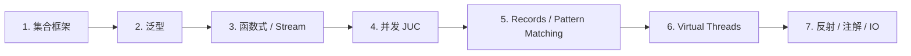

# java-pra

> Java 从入门到精通 · 个人学习仓库
>
> 已有基础语法底子，重点进修进阶特性（集合 / 泛型 / 并发 / 现代特性等）。
> 学一课、写一课、测一课、归档一课。

## 技术栈

| 项 | 版本 |
|----|------|
| Java 工具链 | JDK 25 |
| Gradle | 9.6.1（Kotlin DSL + version catalog）|
| 测试框架 | JUnit Jupiter 6.0.1 |
| 第三方库 | Guava 33.5.0-jre |

## 目录结构

```
app/src/main/java/learning/pra/
├── App.java                  # 入口（Gradle init 模板）
├── collections/              # 集合地基：List / Set / Map / 不可变集合
│   └── ListLab.java
└── generics/                 # 泛型地基：类型参数 / 边界 / PECS / 类型擦除
    └── GenericsLab.java

app/src/test/java/learning/pra/   # 测试与源码同包
└── collections/ListLabTest.java

gradle/libs.versions.toml     # 依赖版本集中管理
```

## 学习路线

按地基 -> 进阶 -> 现代的顺序推进：



## 常用命令

```bash
./gradlew test          # 运行测试
./gradlew run           # 运行 App
./gradlew build         # 完整构建
./gradlew --version     # 查看 wrapper / JDK 版本
```

> 沙箱环境若 `~/.gradle` 只读导致 wrapper 失败，可用系统 `gradle`：
> ```bash
> gradle test --no-daemon --gradle-user-home="$TMPDIR/gradle-home"
> ```

## 学习约定

- **教学模式**：每个主题先讲概念 -> 自己写实现 -> 自己写测试 -> 用 `gradle test` 校验。
- **一课一包**：每个主题独立成包（`collections/`、`generics/`…），不互相依赖。
- **现代特性优先**：JDK 25 环境下，遇到 Records / Pattern Matching / Sealed Classes / Virtual Threads / Switch Pattern 等，优先展示现代写法。

## 进度

- [x] 第一课：集合框架（ListLab）- 去重 / 反转 / 频率 / max / 不可变集合
- [ ] 第二课：泛型（GenericsLab）- 类型参数 / 边界 / PECS / 类型擦除
- [ ] 第三课：函数式与 Stream
- [ ] 第四课：并发与多线程
- [ ] 第五课：现代特性（Records / Pattern Matching / Sealed）
- [ ] 第六课：Virtual Threads
- [ ] 第七课：反射 / 注解 / IO

## 备注

- 包名使用 `learning.pra`，**不要用 `java.*` 开头**（JDK 9+ 模块系统会抛 `Prohibited package name`）。
