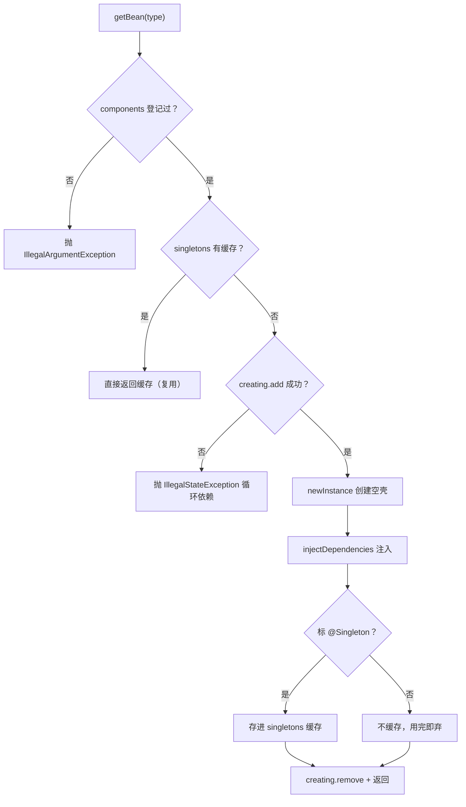
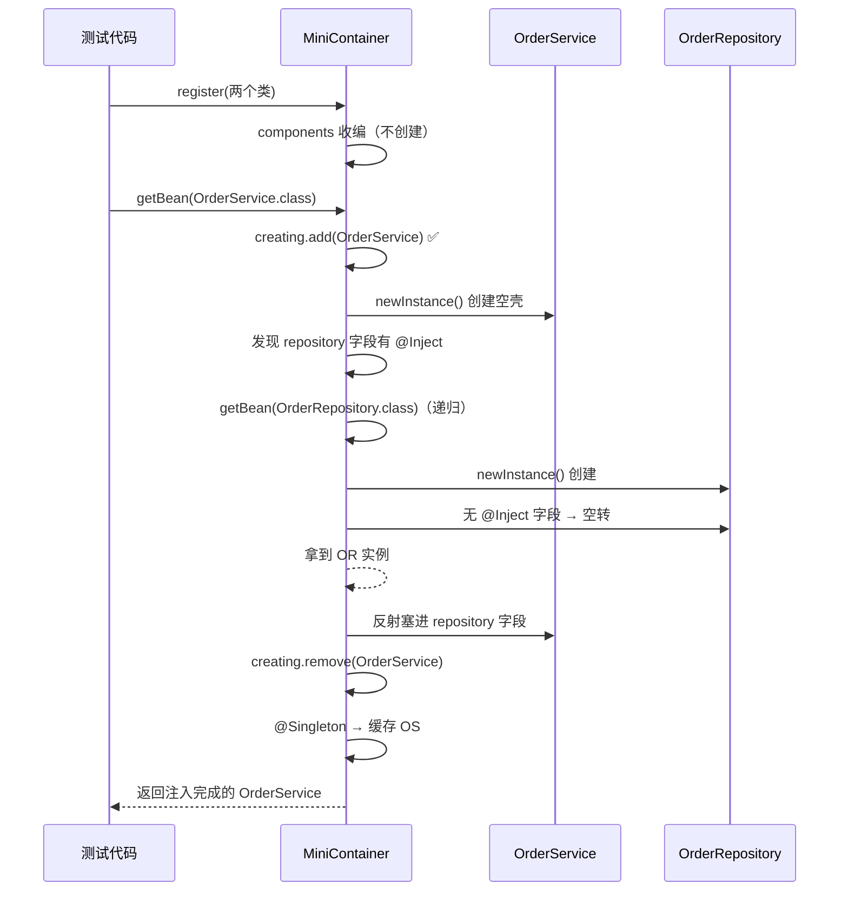

# Java 学习笔记 - Day 16（2026-08-15）

> 学习项目：java-pra（JDK 25 + Gradle 9.6.1 + JUnit Jupiter 6.0.1）
> 进度：第十八课（综合实战）——迷你 IoC 框架，本课全部 5 个概念点 + 2 个测试类完成 ✅
> 说明：**第一次深入理解注解 + 反射**（把第八课反射、第九课注解串起来做成了真实框架）。本笔记为**详尽版**，含完整代码 + 关系图 + 实际踩坑。

---

## 〇、本课总览

| 概念点 | 主题 | 代码 | 测试 |
|--------|------|------|:---:|
| 1 | IoC/DI 思想 + 注解三件套 | Component / Inject / Singleton | AnnotationLabTest（4）|
| 2 | 注册表 + 工厂（register / getBean）| MiniContainer | MiniContainerTest（10）|
| 3 | 懒加载 + 依赖注入 | injectDependencies | 同上 |
| 4 | 循环依赖检测 | creating 集合 | 同上 |
| 5 | 设计模式回看 + 对照 Spring | —— | 同上 |

**一条主线**：用注解"打标" + 反射"读标"，写一个能"new 出对象、注入依赖"的容器——理解 Spring 的 `@Component`/`@Inject` 到底在背后干了啥。

**代码清单**（包 `learning.pra.ioc`）：
- 注解：`Component` / `Inject` / `Singleton`
- 业务类：`OrderService`（依赖方）/ `OrderRepository`（被依赖方）
- 容器：`MiniContainer`
- 测试：`AnnotationLabTest` / `MiniContainerTest`

---

## 一、概念点 1：IoC/DI 思想 + 注解三件套

### 本质
IoC（控制反转）= 依赖的**创建权**从"类自己 `new`"交还给**容器**。类只声明"我要什么"，容器负责给。`@Component` 告诉容器"这个类归你管"，`@Inject` 告诉容器"这个字段的依赖你塞进来"。

### 注解三件套（最终代码）

```java
// Component.java —— 标在类上：这个类由容器管理
@Target(ElementType.TYPE)          // 只能标类/接口
@Retention(RetentionPolicy.RUNTIME)// 保留到运行期，反射才读得到
public @interface Component { }

// Inject.java —— 标在字段上：这个字段需要容器注入
@Target(ElementType.FIELD)
@Retention(RetentionPolicy.RUNTIME)
public @interface Inject { }

// Singleton.java —— 标在类上：这个 Bean 只创建一个实例
@Target(ElementType.TYPE)
@Retention(RetentionPolicy.RUNTIME)
public @interface Singleton { }
```

### 业务类（最终代码）

```java
// OrderService.java —— 依赖方
@Component
@Singleton
public class OrderService {

    @Inject
    private OrderRepository repository;   // 声明"我要一个 OrderRepository"

    public String createOrder(String item) {
        return repository.save(item);     // 用上注入的依赖
    }
}

// OrderRepository.java —— 被依赖方
@Component
public class OrderRepository {
    public String save(String item) {
        return "已保存:" + item;
    }
}
```

### 关键坑（本课最大坑）
**注解类 vs 被标注类**：`Component.class` / `Inject.class` / `Singleton.class` 是**注解类型**（印章），`OrderService` 才是"标了注解的类"（被盖章的模板）。判断"类上标没标注解"要区分两个 API：
- `clazz.isAnnotationPresent(Component.class)` → 返回 `boolean`，**null 安全** ✅ 判断用这个
- `clazz.getAnnotation(Component.class)` → 返回**注解实例**，没注解时返回 **null**，再调 `.equals()`/`.value()` 直接 **NPE** ❌ 取成员值才用这个

---

## 二、概念点 2：注册表 + 工厂（register / getBean）

### 本质
容器 = 一张"登记表"（`components`）+ 一个"成品柜"（`singletons`）。`register` 收编标了 `@Component` 的类；`getBean` 按类型产出实例——**工厂模式**。

| 方法 | 职责 | 类比 |
|------|------|------|
| `register(...)` | 登记 @Component 进 `components` | 服务员记下"有这些菜" |
| `getBean(...)` | 产出实例（缓存/新建）| 按菜名取菜 |

### 关键坑
- **无参构造器是 `getDeclaredConstructor()`**（括号里**不传参**）。传 `(type)` = 找"参数是 type 类型"的构造器 → `NoSuchMethodException`。
- 判断"登没登记"用 `components.contains(type)`，**不是** `type.isAnnotationPresent(Component.class)`——后者只查"带不带注解"，一个标了 `@Component` 但没 register 的类也会被放行。

---

## 三、概念点 3：懒加载 + 依赖注入（容器灵魂）

### 本质
**懒加载** = register 只登记、不创建；第一次 `getBean` 才"创建 + 注入 + 缓存"。这让依赖靠 `getBean` **递归解析**，register 顺序无关（饿汉式会顺序敏感）。

### MiniContainer 最终代码

```java
public class MiniContainer {
    // 单例成品柜
    private Map<Class<?>, Object> singletons = new HashMap<>();
    // 登记表
    private Set<Class<?>> components = new HashSet<>();
    // 创建中（防循环依赖）
    private final Set<Class<?>> creating = new HashSet<>();

    public void register(Class<?>... type) throws ... {
        for (Class<?> clazz : type) {
            // 只收 @Component
            if (clazz.isAnnotationPresent(Component.class)) {
                components.add(clazz);
            }
        }
    }

    public <T> T getBean(Class<T> type) throws ... {
        // ① 未登记拒绝
        if (!components.contains(type)) {
            throw new IllegalArgumentException();
        }
        // ② 缓存命中直接返回
        if (singletons.containsKey(type)) {
            return (T) singletons.get(type);
        }
        // ③ 正在创建又被要 = 循环依赖
        if (!creating.add(type)) {
            throw new IllegalStateException("检测到循环依赖: " + type.getName());
        }
        try {
            // ④ 懒：首次才创建
            T bean = (T) type.getDeclaredConstructor().newInstance();
            // ⑤ 创建完立刻注入
            injectDependencies(bean);
            // ⑥ 只有单例才缓存
            if (type.isAnnotationPresent(Singleton.class)) {
                singletons.put(type, bean);
            }
            return bean;
        } finally {
            // ⑦ 无论成败都清理
            creating.remove(type);
        }
    }

    private void injectDependencies(Object bean) throws ... {
        for (Field field : bean.getClass().getDeclaredFields()) {
            if (field.isAnnotationPresent(Inject.class)) {
                // 破私有无参访问（第八课）
                field.setAccessible(true);
                // 递归注入依赖的依赖
                field.set(bean, getBean(field.getType()));
            }
        }
    }
}
```

### 关键理解（三个"为什么"）
1. **②③ 是"懒"的关键**：`containsKey` 判断"建过没"，没建过才走 ④ —— 第一次创建、第二次复用。
2. **⑥ 只缓存单例**：非单例不入缓存，每次 `getBean` 都新建 → "单例同一实例 / 非单例每次新建"。
3. **⑤ 在 ⑥ 之前**：先注入后缓存，保证缓存里永远是"注入完整的 Bean"。

---

## 四、概念点 4：循环依赖检测

### 本质
`OrderService` 注入 `OrderRepository`、`OrderRepository` 又注入 `OrderService` → `getBean` 无限递归直到 `StackOverflowError`。解法：维护"正在创建中"集合 `creating`，`add` 返回 `false`（元素已存在）= 该 Bean 正在创建又被要了 → 抛清晰异常。

### 递归追踪
```
getBean(A) → creating.add(A) ✅ → 注入 getBean(B)
  → creating.add(B) ✅ → 注入 getBean(A)
    → creating.add(A) ❌ 已存在 → 抛 IllegalStateException
```

### 关键坑
- 异常类型用 `IllegalStateException`（状态非法），不是 `IllegalArgumentException`（参数非法）。
- **`try/finally` 里 `remove`**：异常时也要清理 `creating`，否则污染后续请求（下次 getBean 会误报循环依赖）。

---

## 五、概念点 5：设计模式回看 + 对照 Spring

### 我们用了 3 个经典设计模式
| 模式 | 出现在哪 |
|------|---------|
| 单例模式 | `@Singleton` + `singletons` 缓存 |
| 工厂模式 | `getBean` 按类型产出实例 |
| IoC（控制反转）| 依赖创建权从类交给容器 |

### 对照 Spring 的真实对应关系
| 我们的迷你版 | Spring 对应物 |
|-------------|-------------|
| `@Component` / `@Singleton` | `@Component` / 默认单例 scope |
| `@Inject` | `@Autowired` / `@Inject` |
| `MiniContainer.register` | `@ComponentScan` 组件扫描 |
| `MiniContainer.getBean` | `ApplicationContext.getBean()` |
| 循环依赖抛异常 | 三级缓存（提前暴露半成品 Bean） |

---

## 六、关系图（三张）

### 图 1：三层关系——注解是"印章"，类是"被盖章的模板"，容器是"档案馆"

```mermaid
flowchart LR
    subgraph 印章[注解层 · 三个印章]
        C[@Component<br/>印在类上]
        I[@Inject<br/>印在字段上]
        S[@Singleton<br/>印在类上]
    end
    subgraph 模板[类层 · 被盖章的对象模板]
        subgraph OS["OrderService<br/>@Component + @Singleton"]
            F["repository 字段<br/>@Inject"]
        end
        OR["OrderRepository<br/>@Component"]
    end
    subgraph 档案[容器层 · MiniContainer]
        comp["components 登记集"]
        sin["singletons 单例缓存"]
    end
    C -.-> OS
    C -.-> OR
    S -.-> OS
    I -.-> F
    OS --> comp
    OR --> comp
    OS --> sin
```

> 注：`creating`（创建中集合）是**瞬态标记**——只在 getBean 创建期间存在，创建完就移除，不属于"静态归档"关系，故不画在图 1，改由图 2 / 图 3 展示。

### 图 2：getBean 决策流程（懒加载核心）



### 图 3：`getBean(OrderService)` 完整时序（注入怎么发生）



---

## 七、注解 + 反射深度复习（本课第一次深入理解）

本课把第八课（反射）、第九课（注解）真正用起来，核心是这 5 个反射 API：

| 想干什么 | API | 返回 |
|---------|-----|------|
| 判断"类上标了某注解" | `clazz.isAnnotationPresent(X.class)` | `boolean`（null 安全）|
| 取注解实例（读成员值）| `clazz.getAnnotation(X.class)` | 注解对象或 `null` |
| 取无参构造器 | `clazz.getDeclaredConstructor()` | `Constructor<T>` |
| 取所有声明字段 | `clazz.getDeclaredFields()` | `Field[]` |
| 给私有字段赋值 | `field.setAccessible(true)` + `field.set(obj, value)` | `void` |

**注解两要素复习**（第九课）：
- `@Target`：限定注解能标在哪（`TYPE` 类 / `FIELD` 字段 / `METHOD` 方法……），标错位置编译报错。
- `@Retention`：保留多久。`RUNTIME` 才能被反射读到；默认 `CLASS` 级别反射读不到。

**设计闭环**：`@Retention(RUNTIME)` 保证注解活到运行期 → 反射才能"读标" → 容器才能据此创建/注入。没有 RUNTIME，整个 IoC 无从谈起。

---

## 八、今日踩坑汇总（对话中真实发生）

| # | 坑 | 错在哪 | 正确 |
|---|-----|-------|------|
| 1 | **注解类 vs 被标注类混淆** | `getAnnotation(Component.class).equals(...)` 且无注解时 NPE | `isAnnotationPresent(Component.class)` |
| 2 | 构造器带参 | `MiniContainer(Map, Set)` 没默认无参构造器，`new MiniContainer()` 编译错 | 字段内联初始化，删掉带参构造器 |
| 3 | 无参构造器传参 | `getDeclaredConstructor(type)` | `getDeclaredConstructor()`（不传参）|
| 4 | register 管错注解 | 在 register 里判断 `@Inject`（字段级）| 只认 `@Component`（登记）+ `@Singleton`（缓存）|
| 5 | getBean 判注解不判登记 | `isAnnotationPresent(Component)` | `components.contains(type)` |
| 6 | @Singleton 判断并列 | 非 @Component 也被缓存 | 嵌进 `@Component` 块内 |
| 7 | 单例没缓存 | register 注释掉创建、getBean 没 put → 返回 null | 懒加载：getBean 首次创建+缓存 |
| 8 | 注入依赖没登记 | getBean(OrderRepository) 抛 IllegalArgumentException | OrderRepository 加 @Component，测试一并 register |
| 9 | 循环依赖异常类型 | `IllegalArgumentException` | `IllegalStateException` |
| 10 | 测试漏 throws | 受检异常未声明 → 编译错 | 用例方法加 `throws Exception` |

其中 1/5/6/7 是**容器思维的核心坑**（不是打字错误），反复看。

---

## 九、知识掌握度自评

| 主题 | 掌握度 | 备注 |
|------|-------|------|
| 注解定义（@Target/@Retention）| ⭐⭐⭐⭐ | 三件套独立写对 |
| 反射读注解（isAnnotationPresent/getAnnotation）| ⭐⭐⭐⭐ | 本课最大坑已踩通 |
| IoC/DI 思想 | ⭐⭐⭐⭐ | 能讲清"谁负责 new 出依赖" |
| 懒加载 + 递归注入 | ⭐⭐⭐⭐ | 理解"register 只登记、getBean 才建" |
| 循环依赖检测 | ⭐⭐⭐ | 会检测抛异常；缺：Spring 三级缓存解决法（后续了解）|
| 设计模式（单例/工厂）| ⭐⭐⭐ | 会用但不熟模式命名，建议回看 |

## 十、下一步

- **第十八课完成 = 18 课路线图全部走完** 🎉 可过渡到 Spring Boot 学习（能看懂 `@Component`/`@Inject` 背后原理）
- 建议回看薄弱点：泛型 PECS 实战（第十三课）、Stream 收集器（第十四课）、虚拟线程 pin（第十七课）
- 可选进阶：给 MiniContainer 加"扫包"（模拟 `@ComponentScan`）、构造器注入、`close()` 生命周期
