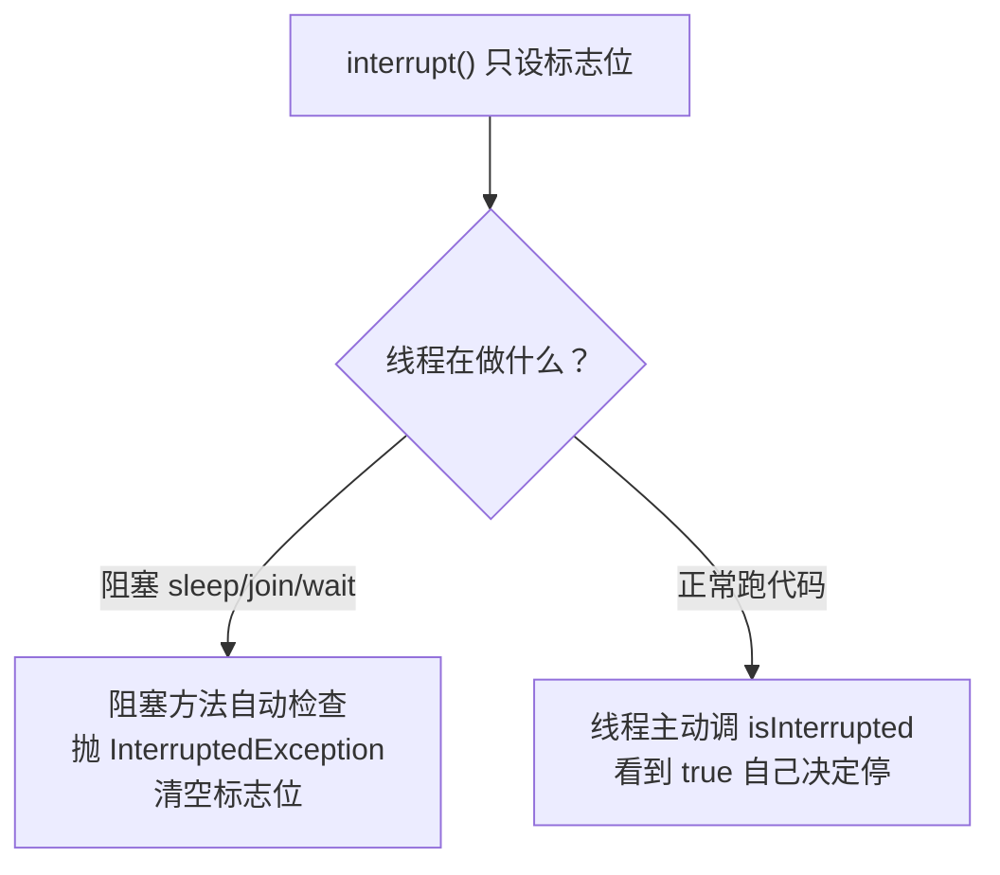
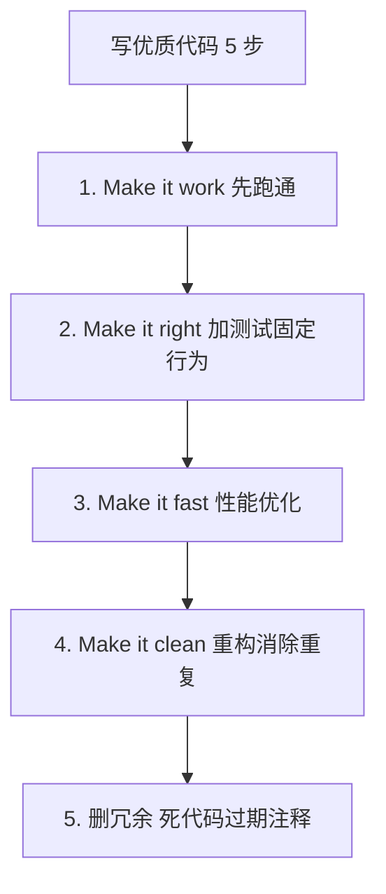

# Java 学习笔记 - Day 2（2026-08-01）

> 学习项目：java-pra（JDK 25 + Gradle 9.6.1 + JUnit Jupiter 6.0.1）
> 进度：第五课（并发与多线程）
> 代码：[app/src/main/java/learning/pra/concurrent/ConcurrencyLab.java](app/src/main/java/learning/pra/concurrent/ConcurrencyLab.java)
> 测试：[app/src/test/java/learning/pra/concurrent/ConcurrencyLabTest.java](app/src/test/java/learning/pra/concurrent/ConcurrencyLabTest.java)（7 个测试全绿）

---

## 一、第五课：并发与多线程（难点，多复习）

### 5.1 进程 vs 线程

| 概念 | 比喻 | 实际 |
|------|------|------|
| 进程 | 一个厨房（独立内存）| JVM 启动后的整个程序 |
| 线程 | 厨房里的厨师（共享内存）| 进程内的执行流 |
| 主线程 | 默认厨师 | `main` 线程，JVM 启动即创建 |
| 守护线程 | 后台服务员 | `setDaemon(true)`，JVM 不等它退出 |

**守护线程反直觉**：名字"守护"其实是"可被抛弃"。JVM 等所有**非守护**线程结束才退出，守护线程（如 GC）被强杀。

### 5.2 创建线程的两种方式

```java
// 方式1：实现 Runnable（推荐，解耦）
Runnable task = () -> System.out.println("hi");
Thread t = new Thread(task, "名字");
t.start();   // 启动新线程

// 方式2：继承 Thread（少用，单继承限制）
class MyThread extends Thread {
    public void run() { System.out.println("hi"); }
}
new MyThread().start();
```

**⚠️ 最常踩的坑**：
- `start()` -> JVM 创建新线程，新线程执行 `run()`
- 直接调 `run()` -> 当前线程同步执行，**没有新线程**

### 5.3 Thread 常用方法

| 方法 | 作用 | 注意 |
|------|------|------|
| `start()` | 启动新线程 | 只能调一次 |
| `run()` | 线程执行体 | 别直接调 |
| `join()` | 等该线程结束 | 抛 InterruptedException |
| `sleep(ms)` | 当前线程休眠 | 静态方法，抛 InterruptedException |
| `interrupt()` | 发停止信号 | 不强制停，协作式 |
| `isInterrupted()` | 查中断标志 | 不清空 |
| `Thread.interrupted()` | 查并清空中断标志 | 静态方法 |
| `setDaemon(true)` | 设为守护线程 | 必须在 start() 前 |

### 5.4 三大并发问题

| 问题 | 含义 | 生活例子 |
|------|------|---------|
| **原子性** | 操作被中途打断 | count++ 三步：读-改-写 |
| **可见性** | 线程 A 改了变量，B 看不到 | CPU 缓存导致 |
| **有序性** | 编译器/CPU 重排序 | 先加盐再加水被重排 |

### 5.5 synchronized（解决原子性 + 可见性）

```java
// 1. 同步方法：锁 this
public synchronized void inc() { count++; }

// 2. 同步静态方法：锁 Class 对象
public static synchronized void inc() { count++; }

// 3. 同步块：锁指定对象（最灵活，推荐）
private final Object lock = new Object();
synchronized (lock) { count++; }
```

**生活比喻**：进试衣间要锁门，门锁就是对象锁，谁拿到锁谁进，其他人排队。

### 5.6 volatile（解决可见性，不保证原子性）

```java
private volatile boolean running = true;  // 多线程立刻可见

// 线程 A
while (running) { ... }   // 没 volatile 可能永远看不到 B 改成 false

// 线程 B
running = false;          // volatile 保证 A 立刻看到
```

**⚠️ 陷阱**：`volatile int count; count++` **仍丢更新**（读-改-写非原子）。要原子用 `AtomicInteger`。

### 5.7 AtomicInteger（CAS 无锁原子）

```java
AtomicInteger counter = new AtomicInteger(0);
counter.incrementAndGet();   // ++count，原子
counter.getAndIncrement();    // count++，原子
counter.compareAndSet(0, 1);  // CAS：期望 0 才设成 1
```

**CAS 原理**（Compare-And-Swap）：
1. 读内存值 `v`
2. 计算新值 `n`
3. `CAS(v, n)`：如果内存还是 `v` 就设为 `n`，否则重试

**为什么比 synchronized 快**：硬件指令保证，无锁不阻塞，失败重试。

**同类 API**（`java.util.concurrent.atomic` 包）：
- `AtomicInteger` / `AtomicLong` / `AtomicBoolean`
- `AtomicReference<V>`
- `LongAdder`（JDK 8+，高并发计数器比 AtomicLong 快）

### 5.8 interrupt 中断机制（协作式，不是抢占式）



**三个角色**：
| 角色 | 作用 | 谁调 |
|------|------|------|
| `interrupt()` | 设置标志位=true | 别人调 |
| `isInterrupted()` | 查询标志位，不清空 | 线程自己调 |
| `InterruptedException` | 阻塞方法遇中断抛的异常 | 阻塞方法抛 |

**关键理解**：
- `interrupt()` **不强制停止**线程，只设标志位（"贴红牌请求停"）
- 对阻塞线程 -> **唤醒** + 抛异常 + 清标志
- 对非阻塞线程 -> 只设标志，线程自己 `isInterrupted()` 主动检查
- 抛 `InterruptedException` 的是**阻塞方法**（sleep/join/wait），不是 `isInterrupted`

**catch 处理口诀**：接到 InterruptedException，**别吞，别忘，恢复 + 抛**：
```java
try {
    t.join();
} catch (InterruptedException e) {
    Thread.currentThread().interrupt();   // 恢复标志位
    throw new RuntimeException(e);          // 报告异常
}
```

### 5.9 BlockingQueue（生产者-消费者）

| 方法 | 队列满时 | 队列空时 | 用途 |
|------|---------|---------|------|
| `put(e)` | 阻塞等待 | - | 生产者放数据 |
| `take()` | - | 阻塞等待 | 消费者取数据 |
| `offer(e)` | 返回 false | - | 不阻塞 |
| `poll()` | - | 返回 null | 不阻塞 |

**实现类**：
- `ArrayBlockingQueue`：有界，数组实现（任务 5 用）
- `LinkedBlockingQueue`：可有界可无界
- `SynchronousQueue`：容量 0，直接交接

### 5.10 虚拟线程（JDK 21+ 稳定）

| 维度 | 平台线程 | 虚拟线程 |
|------|---------|---------|
| 底层 | 1:1 OS 线程 | 挂载到载体线程 |
| 成本 | ~1MB 栈 | ~几 KB |
| 上限 | 数千 | 百万级 |
| 适用 | CPU 密集 | **IO 密集** |
| 阻塞 | 浪费 OS 线程 | 让出载体线程 |

```java
// 批量启动虚拟线程
try (ExecutorService executor = Executors.newVirtualThreadPerTaskExecutor()) {
    List<Future<Integer>> futures = new ArrayList<>();
    for (int i = 0; i < n; i++) {
        final int index = i;
        futures.add(executor.submit(() -> {
            Thread.sleep(1);
            return index;
        }));
    }
    for (Future<Integer> f : futures) {
        sum += f.get();
    }
}
```

**⚠️ 原则**：
- 虚拟线程为 **IO 密集**场景而生（HTTP 请求、DB 查询）
- 不要池化虚拟线程：用完即弃，每任务一个新虚拟线程
- 虚拟线程内避免 `synchronized` 长阻塞（会钉住载体线程），改用 `ReentrantLock`

### 5.11 第五课真实坑

#### 坑 5.1：`start()` 没接返回值 / 没 `join()`
```java
// ❌ 没 join，return 时子线程可能没跑完
t1.start();
return name[0];   // 可能是 null

// ✅ join 等子线程完成
t1.start();
t1.join();        // 阻塞等
return name[0];
```

#### 坑 5.2：`synchronized` 语法错
```java
synchronized safeCount++;              // ❌ 不是语句修饰符
synchronized (lock) safeCount++;       // ❌ 后必须有 {}
synchronized (lock) { safeCount++; }   // ✅
```

#### 坑 5.3：`volatile` 不保证原子性
```java
volatile int count = 0;
count++;   // ❌ 仍丢更新，读-改-写非原子
// ✅ 用 AtomicInteger
AtomicInteger count = new AtomicInteger(0);
count.incrementAndGet();
```

#### 坑 5.4：空 while 循环导致 int 溢出
```java
while (running) { loopCount++; }
// 1秒能跑约 10^9 次，int max ≈ 2.1×10^9，2 秒溢出变负数
// ✅ 加 sleep 防溢出
while (running) {
    loopCount++;
    Thread.sleep(1);   // 每次睡 1ms，1秒约 1000 次
}
```

#### 坑 5.5：lambda 捕获循环变量
```java
for (int i = 0; i < n; i++) {
    executor.submit(() -> {
        return i;   // ❌ 编译错误，i 不是 effectively final
    });
}

// ✅ 用 final 变量快照
for (int i = 0; i < n; i++) {
    final int index = i;
    executor.submit(() -> {
        return index;   // 每个 lambda 捕获自己的 index
    });
}
```

#### 坑 5.6：catch 吞异常不恢复中断标志
```java
} catch (InterruptedException e) {
    e.printStackTrace();   // ❌ 吞了，中断信号丢失
}
// ✅ 恢复 + 抛
} catch (InterruptedException e) {
    Thread.currentThread().interrupt();
    throw new RuntimeException(e);
}
```

#### 坑 5.7：`t1.getName()` 取的不是子线程体内的名字
```java
Thread t1 = new Thread(task, "lab-thread");
return t1.getName();   // ❌ 返回构造名字，不能证明子线程跑过
// ✅ 在 lambda 内调 Thread.currentThread().getName() 并传回
```

### 5.12 第五课代码评审心得

1. **DRY 原则**：unsafe/safe 两方法 90% 重复，提取 `runWithFourThreads` 辅助方法
2. **辅助方法封装**：`joinQuietly` 集中处理 join + InterruptedException 样板
3. **字段语义**：实例字段应表达状态，不当临时变量
4. **重构顺序**：Make it work -> Make it right -> Make it clean

### 5.13 优质代码方法论



**口诀**：先工作，再正确，后性能，最后干净。

---

## 二、今日学习心得

### 做得好的
1. **从概念到源码**：第五课 interrupt 机制追问到 `Thread.interrupt()` 源码，理解了协作式中断而非抢占式
2. **对比驱动**：unsafe / synchronized / AtomicInteger 三种写法并跑，直观看出丢更新 vs 安全
3. **重构意识**：主动提取 `runWithFourThreads` 和 `joinQuietly`，体会 DRY
4. **7 个测试全绿**：覆盖 6 个任务 + volatile 可见性验证

### 需改进的
1. **并发设计敏感度不够**：多个 bug 都是并发特有问题（缺 join、int 溢出、lambda 捕获），需多练
2. **异常处理不规范**：习惯 `printStackTrace` 吞异常，要固化"恢复中断标志 + 抛 RuntimeException"
3. **测试边界先想后写**：volatile 任务先遇到溢出才补 sleep，应预先考虑循环速率
4. **`Future`/`CompletableFuture` 不熟**：任务 6 留了尾巴，异步编程要专项补强

### 明天计划
- ~~补强 `Collectors` 和 `Collections` 工具类的常用方法~~
- ~~补强异步编程：`CompletableFuture`（第五课留的尾巴）~~ ✅ 已完成（6 个补强任务全绿）
- ~~或第六课：IO 与文件（NIO.2 / Path / Files）~~

### CompletableFuture 补强完成记录（2026-08-02）

6 个任务全绿（[ConcurrencyLab.java](app/src/main/java/learning/pra/concurrent/ConcurrencyLab.java) 内 `asyncSum` / `gatherAll` / `withFallback` / `withTimeout` / `applyNested` / `composeFlat`，15 个测试通过）：

| # | 任务 | 核心 API | 心智点 |
|---|------|---------|--------|
| 1 | `asyncSum` | `supplyAsync` + `thenCombine` + `join` | 二元并行组合 |
| 2 | `gatherAll` | `allOf` + 顺序 `join` | N 元组合 + `allOf` 不带结果 |
| 3 | `withFallback` | `exceptionally` | 异常降级，吞异常返回 fallback |
| 4 | `withTimeout` | `orTimeout` + `TimeUnit.MILLISECONDS` | 超时异常包装链 cause=TimeoutException |
| 5a | `applyNested` | `thenApply` 链式 | 嵌套地狱：要 3 层 lambda 内嵌 thenApply |
| 5b | `composeFlat` | `thenCompose` 链式 | 扁平化：永远 1 层，CF 的 flatMap |

**核心心智**：
- CF 是声明式异步流水线：创建（`supplyAsync`）+ 编排（`thenApply`/`thenCompose`/`thenCombine`/`allOf`）+ 异常处理（`exceptionally`）+ 取结果（`join`）
- `thenApply` 返回普通值用，`thenCompose` 返回 CF 用（避免嵌套地狱）
- `allOf` 返回 `CF<Void>` 不带结果，要自己遍历 join
- `join` 抛 unchecked `CompletionException`，`get` 抛 checked；纯计算场景用 `join`
- 异常在 CF 内部不自动传播，`exceptionally` 拦截后返回新 CF（正常完成）

### 后续计划
- 进入第六课：IO 与文件（NIO.2 / Path / Files）
- 或继续补强基础库：`Collectors` / `Collections` / `String` 全套

---

## 三、待补强基础库（并发相关，已学需巩固）

- [x] `Thread` / `Runnable` / `start` vs `run` / `join`
- [x] `synchronized` 同步块 `synchronized (lock) { ... }`
- [x] `volatile` 可见性（不保证原子性）
- [x] `AtomicInteger` / `incrementAndGet` / `compareAndSet`（CAS）
- [x] `BlockingQueue` / `ArrayBlockingQueue` / `put` / `take`
- [x] 虚拟线程 `Executors.newVirtualThreadPerTaskExecutor()`（JDK 21+）
- [x] `CompletableFuture` 异步编程（补强完成，6 任务全绿）
  - `supplyAsync` / `runAsync` / `completedFuture`
  - `thenApply` / `thenCompose`（区别：返回普通值 vs 返回 CF）
  - `thenCombine` / `allOf` / `anyOf`（组合多 CF）
  - `exceptionally` / `handle` / `whenComplete`（异常处理三选一）
  - `orTimeout` / `completeOnTimeout`（JDK 9+ 超时）
- [ ] `ReentrantLock` / `Condition`（对比 synchronized）
- [ ] `wait` / `notify` / `notifyAll` 底层（BlockingQueue 内部用）
