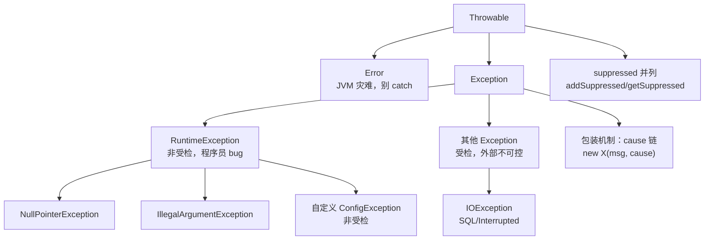

# Java 学习笔记 - Day 3（2026-08-02）

> 学习项目：java-pra（JDK 25 + Gradle 9.6.1 + JUnit Jupiter 6.0.1）
> 进度：第六课（异常体系）
> 代码：[app/src/main/java/learning/pra/exceptions/ExceptionLab.java](app/src/main/java/learning/pra/exceptions/ExceptionLab.java)、[app/src/main/java/learning/pra/exceptions/ConfigException.java](app/src/main/java/learning/pra/exceptions/ConfigException.java)
> 测试：[app/src/test/java/learning/pra/exceptions/ExceptionLabTest.java](app/src/test/java/learning/pra/exceptions/ExceptionLabTest.java)（11 个测试全绿）

---

## 一、第六课：异常体系

### 6.1 异常家族树 + 受检 vs 非受检

**家族树**：
```
Throwable
├── Error                    ← JVM 级灾难，不 catch（OOM / StackOverflow）
└── Exception
    ├── RuntimeException     ← 非受检（NPE / ArrayIndex / Arithmetic / ClassCast）
    └── 其他 Exception 子类   ← 受检（IOException / SQLException / InterruptedException）
```

**判定口诀**：是 `RuntimeException` 子类 -> 非受检；是 `Exception` 子类但**不是** `RuntimeException` 子类 -> 受检。`Error` 另算。

| 维度 | Error | 受检异常 | 非受检异常 |
|------|-------|---------|----------|
| 根类 | `Error` | `Exception`（非 RT） | `RuntimeException` |
| 谁的锅 | JVM | 外部环境 | 程序员 |
| 编译器 | 不管 | **逼处理** | 不管 |
| 处理方式 | 别 catch | `try/catch` 或 `throws` | 修代码 |
| 例子 | OOM / StackOverflow | IOException / SQLException / InterruptedException | NPE / ArrayIndex / Arithmetic |

**一句话**：
- 受检 = 编译器逼你"承认风险 + 写预案"
- 非受检 = 编译器信任你"写对代码就不会发生"

### 6.2 try-with-resources + finally 语义

**资源关闭三个时机**：try 块正常结束 / try 块抛异常 / close() 自己抛异常（自动加到 suppressed）。

```java
// ✅ JDK 7+ try-with-resources：编译器自动 close
try (BufferedReader reader = new BufferedReader(new FileReader(path))) {
    return reader.readLine();
}   // <- 自动调 reader.close()

// 多资源，关闭顺序 = 声明逆序（栈式）
try (Resource a = new Resource("A"); Resource b = new Resource("B")) {
    a.use(); b.use();
}   // 关闭顺序：B.close() -> A.close()
```

**`AutoCloseable` 接口**（JDK 7）：
```java
public interface AutoCloseable {
    void close() throws Exception;   // 签名宽松，实现者按需缩窄
}
public interface Closeable extends AutoCloseable {   // JDK 5 更老
    void close() throws IOException;   // 受限，幂等
}
```

**`finally` 永远会跑**（3 种例外）：
1. `try` 块 return -> finally 仍执行
2. `try` 块抛异常 -> finally 仍执行
3. 例外：`System.exit(0)` / JVM 崩溃 / 断电 / 守护线程被 JVM 强杀

**⚠️ finally 最坑**：finally 的 `return` 会**覆盖** try 的 return 值：
```java
int foo() {
    try { return 1; }
    finally { return 2; }   // 实际返回 2，不是 1
}
```

**try-with-resources 执行顺序**：资源初始化 -> try 体 -> catch -> finally -> 自动 close。

**`Suppressed` 异常**：业务代码和 close() 都抛时，编译器自动把 close 的异常挂到主异常的 suppressed 列表，不覆盖：
```java
// 取回：ex.getSuppressed() -> Throwable[]
```

**try 三种形式速查**：

| 形式 | 何时用 | 特点 |
|------|--------|------|
| `try-finally` | 只清理不捕异常 | finally 必跑，异常传播 |
| `try-catch` | 捕异常处理 | 不加 finally |
| `try-with-resources` | 有 `AutoCloseable` 资源 | 自动 close + suppressed |
| `try-with-resources-catch-finally` | 全都要 | 顺序：体 -> catch -> finally -> close |

### 6.3 异常链与 cause（包装 / 解包）

**为什么需要包装**：底层抛 `IOException`，但服务层只该对外暴露 `BusinessException`，不想让上层知道底层用 IO 还是 DB。包装时**必须**传 cause，否则根因丢失。

**三种"挂载"机制对比**：

| 机制 | API | 用途 | 同层/跨层 |
|------|-----|------|----------|
| 构造器 cause | `new X("msg", cause)` | 包装异常时一并传入根因 | 跨层（外层包内层）|
| `initCause()` | `ex.initCause(cause)` | 构造后才决定挂 cause | 跨层 |
| `addSuppressed()` | `ex.addSuppressed(suppressed)` | 一个主异常 + 多个并列副异常 | 同层并列 |

**cause vs suppressed 对比**：

| 维度 | `cause`（链式） | `suppressed`（列表） |
|------|----------------|---------------------|
| 数据结构 | 单链表（一对一） | 数组（一对多） |
| 语义 | "因为这个原因，我才抛" | "顺带还发生了这些" |
| 典型场景 | 分层架构包装 | try-with-resources 业务和 close 都抛 |
| 取回 | `ex.getCause()` | `ex.getSuppressed()` 返回 `Throwable[]` |
| 谁设置的 | 业务代码 `new X(msg, cause)` | 编译器自动（try-with-resources）|

**遍历 cause 链的标准写法**：
```java
public static Throwable unwrapRoot(Throwable ex) {
    Throwable current = ex;
    while (current.getCause() != null) {   // 顺着链走到尽头
        current = current.getCause();
    }
    return current;
}
```

**Day2 联想**：`CompletableFuture.withTimeout` 的异常包装链：
- 任务超时 -> `orTimeout` 内部 cause=TimeoutException
- `join()` 包成 `CompletionException`
- `.getCause()` 拿到 TimeoutException

### 6.4 自定义异常设计

**第一个决策：受检 vs 非受检**：
- 调用方**有合理恢复方案** -> 受检（IOException 可重试、InterruptedException 要恢复中断标志）
- 调用方**除了传播啥也干不了** -> 非受检（NPE、IllegalArgumentException）
- **现代 Java 社区趋势**：多用非受检（`CompletableFuture` 的异常都包成 `CompletionException` 非受检）

**异常层次结构设计**：
```
DomainException（所有业务异常的根，非受检）
├── ConfigException（配置类问题）
│   └── MissingConfigException（具体：缺配置项）
├── AuthException（认证类）
│   └── InvalidTokenException
└── PaymentException（支付类）
    └── InsufficientFundsException
```
好处：上层 `catch (AuthException e)` 能抓一族异常。

**自定义异常四件套构造器**（镜像 JDK `Exception`）：
```java
public class DomainException extends RuntimeException {
    private static final long serialVersionUID = 1L;

    public DomainException() { super(); }
    public DomainException(String message) { super(message); }
    public DomainException(String message, Throwable cause) { super(message, cause); }
    public DomainException(Throwable cause) { super(cause); }
}
```

**消息格式好习惯**：
- 消息面向**人类**（排查日志），字段面向**程序**（条件判断）
- ❌ `"配置项 timeout 在 config.properties 第 5 行缺失"`（啰嗦，调用方拿不到结构化数据）
- ✅ 消息 `"配置项缺失: " + key` + 字段 `private final String key; public String key() { return key; }`

**`serialVersionUID`**：`Throwable` 实现了 `Serializable`，不声明时 JVM 按类结构自动算 hash，类改了（加字段）反序列化会失败。现代 Java 几乎不序列化异常（除 RMI/分布式），不声明也能跑但 IDE 会警告，习惯上声明 `1L`。

**`fillInStackTrace` 性能优化**（进阶）：默认抓整个调用栈非常贵（JVM 走栈帧）。业务异常不需要排查调用链时可重写为空（性能 10x+），学习阶段先不用。

**Pattern Matching 与异常**（JDK 21+）：catch 语法仍是 `catch (Type name)`，但 catch 之后处理异常对象可用 switch pattern：
```java
String level = switch (ex) {
    case ConfigException c -> "CONFIG";
    case AuthException a   -> "AUTH";
    case null              -> "UNKNOWN";
    default                -> "OTHER";
};
```

**自定义异常检查清单**：

| 项 | 默认建议 |
|----|---------|
| 继承谁 | 多数 `RuntimeException`，IO/SQL 等有恢复方案才继承 `Exception` |
| 构造器 | 至少 `(String)` 和 `(String, Throwable)`，全的话四件套 |
| `serialVersionUID` | 显式声明 `1L` |
| 命名 | 以 `Exception` 结尾（不是 `Error`）|
| 消息 | 简短描述 + 结构化字段 |
| 访问性 | `public`（生产）/ 包级（学习阶段 OK）|

---

## 二、真实遇到的坑（非理解错误，是实际编程陷阱）

### 坑 6.1：`close()` 不应该故意抛异常

```java
// ❌ close 抛 UnsupportedOperationException，try-with-resources 一关就触发异常
@Override
public void close() throws Exception {
    System.out.println("[" + name + "] close");
    throw new UnsupportedOperationException("Unimplemented method 'close'");
}

// ✅ close 不抛异常，只清理
@Override
public void close() {
    System.out.println("[" + name + "] close");
}
```
**根因**：`AutoCloseable.close()` 声明 `throws Exception` 是签名宽松，**不是要求你抛**。实现者按需缩窄签名是好习惯。close 抛异常会导致业务正常返回值被丢弃，走 catch。

### 坑 6.2：`close() throws Exception` 导致方法链被迫声明 throws

```java
// ❌ close 声明 throws Exception，导致 demoResourceOrder 也得 throws Exception
public void close() throws Exception { ... }
public static String demoResourceOrder() throws Exception { ... }   // 被迫加

// ✅ close 不抛异常时缩窄签名
public void close() { ... }
public static String demoResourceOrder() { ... }   // 调用方干净
```

### 坑 6.3：`switch pattern` 不适合"遍历 cause 链"

```java
// ❌ switch 是按类型分发，不适合"顺着链走到尽头"
public static Throwable unwrapRoot(Throwable ex) {
    switch (ex) {
        case ConfigException e: return ConfigException();
        default: break;
    }
}

// ✅ while 循环，通用
Throwable current = ex;
while (current.getCause() != null) {
    current = current.getCause();
}
return current;
```
**根因**：switch pattern 用于"按类型分发"，遍历链式结构要用循环。

### 坑 6.4：方法引用不能赋给声明 throws checked 异常的 Runnable

```java
// ❌ demoResourceOrder() throws Exception，方法引用 ExceptionLab::demoResourceOrder
//    不能赋给 Runnable（Runnable.run() 不抛 checked）
String output = captureStdout(ExceptionLab::demoResourceOrder);   // 编译错

// ✅ 用 lambda 包裹，把 checked 包成 unchecked
String output = captureStdout(() -> {
    try {
        ExceptionLab.demoResourceOrder();
    } catch (Exception e) {
        throw new RuntimeException(e);
    }
});
```
**根因**：`Runnable.run()` 签名不抛 checked 异常，方法引用的目标方法 throws Exception 时不兼容。这是 Day2 学过的"checked 异常传播受限"的延续。

### 坑 6.5：finally 的 return 覆盖 try 的 return（反直觉）

```java
public static String finallySwallowsReturn() {
    try {
        return "yes1";        // 看起来应该返回这个
    } finally {
        return "finally";     // 实际返回这个，try 的返回值被丢弃
    }
}
```
**根因**：finally 块**永远会跑**，包括 try 已经 return 的情况。如果 finally 也 return，JVM 会丢弃 try 的返回值，用 finally 的。**生产代码别在 finally 里 return**。

### 坑 6.6：沙箱 `/tmp` 只读，JUnit `@TempDir` 失败

```java
// ❌ @TempDir 在沙箱抛 ExtensionConfigurationException / FileSystemException
@TempDir Path tempDir;

// ❌ Files.createTempFile 也抛 FileSystemException: 只读文件系统
Path file = Files.createTempFile("pre-", ".txt");

// ✅ 写到 workspace 内 build/tmp/（Gradle 清理范围，可写）
Path dir = Path.of("build", "tmp", "exc-lab-test");
Files.createDirectories(dir);
Path file = dir.resolve("test.txt");
try {
    Files.writeString(file, "hello");
    ...
} finally {
    Files.deleteIfExists(file);
}
```
**根因**：沙箱 `/tmp` 挂载为只读文件系统。已登记到 [陷阱速查](#)。

### 坑 6.7：`exceptionally` 与 `thenCompose` 的语义混淆（Day2 复习）

```java
// ❌ exceptionally 的 fn 返回直接值，不是 CF
cf.exceptionally(ex -> CompletableFuture.supplyAsync(...));   // 类型错

// ✅ exceptionally 返回直接值
cf.exceptionally(ex -> fallback);
// 要返回 CF 用 thenCompose
cf.thenCompose(x -> next(x));
```

---

## 三、今日代码产出

### `ExceptionLab.java` 方法清单

| 方法 | 作用 | 演示点 |
|------|------|--------|
| `readFileLine(path) throws IOException` | 用 BufferedReader 读首行 | 受检异常声明 + try-with-resources |
| `firstOf(arr)` | 返回首元素 | 非受检异常不强制处理 |
| `demoResourceOrder() throws Exception` | 两个 Resource 自动关 | 关闭顺序逆序（B 先关 A 后关）|
| `finallySwallowsReturn()` | try return + finally return | finally 覆盖 try 返回值 |
| `loadConfig(path)` | 调 readFileLine，包装异常 | 异常包装（IO -> Config） |
| `unwrapRoot(ex)` | 遍历 cause 链到尽头 | while 循环遍历异常链 |

### `ConfigException.java`（独立 public 类）

- 继承 `RuntimeException`（非受检）
- `serialVersionUID = 1L`
- 四件套构造器（无参 / 单 msg / msg+cause / 单 cause）

### 测试覆盖（11 个全绿）

| 测试 | 验证点 |
|------|--------|
| `readFileLine_returnsFirstLine` | 正常路径 + try-with-resources 自动关流 |
| `readFileLine_missingPath_throwsIOException` | 受检异常确实声明，路径不存在时自然抛 |
| `firstOf_returnsFirstElement` | 非空数组正常返回 |
| `firstOf_emptyArray_throwsArrayIndexOutOfBounds` | 非受检异常编译器不管 |
| `demoResourceOrder_returnsOk` | try-with-resources 正常路径不抛 |
| `demoResourceOrder_closesInReverseDeclarationOrder` | 关闭顺序逆序（B 先关 A 后关）|
| `finallySwallowsReturn_overridesTryReturnValue` | finally 的 return 覆盖 try 的 return |
| `loadConfig_validPath_returnsFirstLine` | 包装方法的正常路径 |
| `loadConfig_missingPath_throwsConfigExceptionWithIoCause` | 异常包装 + cause 保留 |
| `unwrapRoot_singleLayer_returnsItself` | 没 cause 时自己就是根 |
| `unwrapRoot_twoLayers_returnsInnerCause` | 两层链返回内层 |
| `unwrapRoot_threeLayers_returnsDeepestCause` | 三层链走到尽头 |
| `unwrapRoot_fiveLayers_returnsDeepestCause` | 五层链验证循环健壮性 |

---

## 四、异常体系结构图



---

## 五、待补强基础库清单（异常相关）

- [ ] `Throwable` 全套 API：`getMessage` / `getLocalizedMessage` / `getCause` / `getSuppressed` / `addSuppressed` / `getStackTrace` / `setStackTrace` / `fillInStackTrace`
- [ ] `Exceptions` 工具类（Guava / Apache Commons Lang3）：`Throwables.getRootCause` / `getStackTraceAsString`
- [ ] `try-with-resources` + `Suppressed` 异常取回实战
- [ ] 自定义异常的 `fillInStackTrace` 性能优化场景
- [ ] 异常与日志框架集成（SLF4J / Logback）

---

## 六、今日学习心得

### 做得好的
1. **从已有感性认识到系统化**：Day2 已反复踩 InterruptedException / CompletionException / TimeoutException，今天系统梳理异常家族树，认知闭环
2. **测试驱动验证边界**：5 层嵌套 cause 链、finally 覆盖返回值、关闭顺序逆序，都用测试验证而非靠脑补
3. **重构意识**：把嵌套的 ConfigException 升级为独立 public 类 + 四件套构造器 + serialVersionUID，符合生产代码规范

### 需改进的
1. **拼写细节**：`firestOf` -> `firstOf`（已修）、`close` 打印 "close" 而非 "closed"（小瑕疵）
2. **未用 import 残留**：`javax.management.RuntimeErrorException` 未删（IDE 标灰要养成清理习惯）
3. **签名设计敏感度**：`close() throws Exception` 不抛异常时未缩窄签名，导致调用链被迫声明 throws

### 异常体系核心认知
- **三选一决策**：Error / 受检 / 非受检，看"谁的锅 + 调用方能否恢复"
- **两条原则**：不吞异常 + 包装传 cause
- **两种挂载**：cause 链（一对一跨层）/ suppressed 列表（一对多同层）
- **finally 永跑**：但别在 finally 里 return（会覆盖 try 的返回值）
- **try-with-resources 自动 close**：关闭顺序 = 声明逆序（栈式）

### 明天候选主题
- IO 流体系（字节流 / 字符流 / 缓冲流 / NIO.2）
- 注解（Annotation）
- 反射（Reflection）
- IO + 异常综合实战（结合今天的 try-with-resources）
