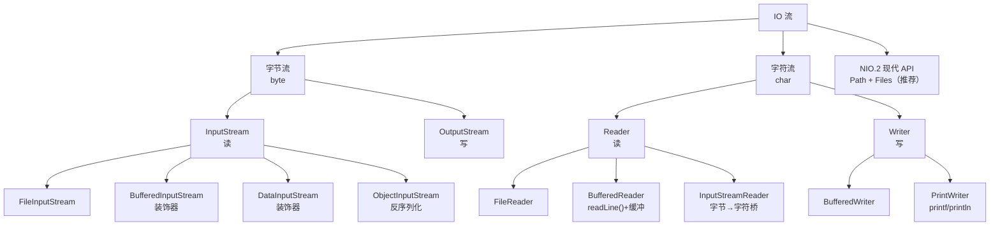

# Java 学习笔记 - Day 4（2026-08-03）

> 学习项目：java-pra（JDK 25 + Gradle 9.6.1 + JUnit Jupiter 6.0.1）
> 进度：第七课（IO 流体系）
> 代码：[app/src/main/java/learning/pra/io/IoLab.java](app/src/main/java/learning/pra/io/IoLab.java)
> 测试：[app/src/test/java/learning/pra/io/IoLabTest.java](app/src/test/java/learning/pra/io/IoLabTest.java)（15 个测试全绿）

---

## 一、第七课：IO 流体系

### 7.1 IO 流家族树

**两条主线 × 两个方向 = 四大家族**：

|  | 输入（读）| 输出（写）|
|--|---------|---------|
| **字节流**（byte，8-bit）| `InputStream` | `OutputStream` |
| **字符流**（char，16-bit）| `Reader` | `Writer` |

**字节流**处理任何数据（图片/视频/二进制/文本）。**字符流**专处理文本（自动处理编码）。

**家族树（核心类）**：
```
字节流
├── InputStream（抽象基类）
│   ├── FileInputStream          ← 读文件
│   ├── ByteArrayInputStream     ← 内存 byte[]
│   ├── FilterInputStream        ← 装饰器基类
│   │   ├── BufferedInputStream  ← 加缓冲
│   │   └── DataInputStream      ← 读 Java 基本类型
│   └── ObjectInputStream        ← 反序列化
└── OutputStream
    ├── FileOutputStream / ByteArrayOutputStream
    ├── FilterOutputStream（BufferedOutputStream / DataOutputStream / PrintStream）
    └── ObjectOutputStream

字符流
├── Reader
│   ├── FileReader / BufferedReader（readLine）/ InputStreamReader（桥）/ StringReader
└── Writer
    ├── FileWriter / BufferedWriter / PrintWriter / OutputStreamWriter / StringWriter
```

**核心基类方法**：
- `InputStream.read()`（读 1 字节，-1 末尾）/ `read(byte[])`（批量）
- `OutputStream.write(int)` / `write(byte[])`
- `Reader.read()`（读 1 字符，-1 末尾）/ `read(char[])`
- `Writer.write(int)` / `write(String)`（Writer 特有便利方法）

**字节流 vs 字符流对比**：

| 维度 | 字节流 | 字符流 |
|------|--------|--------|
| 单位 | byte（8-bit）| char（16-bit）|
| 基类 | InputStream/OutputStream | Reader/Writer |
| 处理对象 | 任何数据 | 仅文本 |
| 编码处理 | 不解码 | 自动按编码解码 |
| 何时用 | 图片/视频/二进制/网络 | 文本文件 |

**字符流读中文自动解码；字节流读文本要手动 `new String(bytes, charset)` 解码。**

### 7.2 装饰器模式（IO 的教科书案例）

**四要素**：抽象组件（Reader/InputStream）/ 具体组件（FileReader）/ 抽象装饰器（FilterReader）/ 具体装饰器（BufferedReader）。

**核心理解**：`BufferedReader` 自己不读文件，委托内部 `FileReader` 读，自己只管缓冲和 readLine。

```java
// 套娃：每套一层多能力，类型还是 Reader
BufferedReader r = new BufferedReader(new FileReader("a.txt"));
//                  ^装饰器         ^具体组件
```

**性能：BufferedReader 快 10 倍**（1MB 文件：FileReader 单字符 ~50ms/100万次 syscall，BufferedReader ~5ms/~125 次 syscall）。

**装饰器比继承好**：继承要组合爆炸（N 组件 × M 能力 = N×M 类），装饰器只需 N+M 类。

**识别口诀**：构造器接收同类型对象 -> 八成是装饰器。

**装饰器链的 close**：只声明最外层 try-with-resources，内部级联 close（外到内）。

**陷阱**：套娃后只用最外层，别操作内部具体组件（缓冲会乱）。

**实际应用**：`GZIPInputStream`（解压）/ `CipherInputStream`（解密）/ `DataInputStream`（读类型）/ `Collections.synchronizedList`（线程安全）/ `HttpServletRequestWrapper`（Servlet）。

### 7.3 try-with-resources 在 IO 中的实战陷阱

**10 个陷阱速查**：

| 陷阱 | 关键点 |
|------|--------|
| 大文件全读 | 用 `lines()` 流式处理 |
| close 异常 | try-with-resources 自动 suppressed |
| 装饰器链 | 只声明最外层，内部级联关 |
| 多独立资源 | 都声明，逆序关 |
| 编码 | 显式指定 UTF-8，不靠默认 |
| 缓冲流 | `close()` 会 flush，但频繁写要显式 flush |
| PrintWriter | 默认缓冲，要 close 或 autoFlush |
| 中文 | 字节流读文本要手动解码 |
| 关闭后再用 | 抛 Stream closed |
| 吞异常 | 不吞，记录 + 包装抛 |

**流式复制经典模板**（8KB 缓冲块）：
```java
byte[] buffer = new byte[8192];
int n;
while ((n = inputStream.read(buffer)) != -1) {
    outputStream.write(buffer, 0, n);   // 只写实际读到的 n 字节
}
```

### 7.4 Scanner / PrintWriter 便捷工具

**Scanner**：按类型解析输入（int/double/boolean），三种输入源（文件/字符串/控制台）。

```java
Scanner sc = new Scanner(Path.of("data.txt"), StandardCharsets.UTF_8);
while (sc.hasNextInt()) {   // hasNextXxx 必须与 nextXxx 同类型配对
    num += sc.nextInt();
}
```

**⚠️ nextInt vs nextLine 坑**：`nextInt()` 读数字后换行符留在缓冲区，`nextLine()` 读到空串。要加 `sc.nextLine()` 吃掉残留。

**PrintWriter**：人类友好输出（print/println/printf），格式化 `%s %d %.2f %x %b %t`。

```java
PrintWriter pw = new PrintWriter(new FileWriter("out.txt"), true);  // true = autoFlush
for (String line : lines) {
    pw.println(line);   // 可变参数要遍历，不能整体 println
}
```

**Scanner vs BufferedReader**：Scanner 按类型解析（慢），BufferedReader 按行/字符（快，大文件用）。
**PrintWriter vs BufferedWriter**：PrintWriter 格式化 + 吞异常（checkError），BufferedWriter 高效 + 抛异常。

### 7.5 NIO.2（Path / Files，JDK 7+）

**核心概念**：`Path` 是路径抽象表示（不操作文件），`Files` 是文件操作工具类（静态方法）。`File`（JDK 1.0 旧 API）被取代。

**创建 Path**：`Path.of()`（JDK 11+ 推荐）/ `Paths.get()`（JDK 7）/ `new File().toPath()`。

**Files 常用方法**：

| 方法 | 作用 | JDK |
|------|------|-----|
| `Files.readString(path)` | 读整个文件为 String | 11+ |
| `Files.writeString(path, str)` | 写 String | 11+ |
| `Files.readAllBytes` / `Files.write` | 字节读写 | 7+ |
| `Files.copy(src, dst, options)` | 复制 | 7+ |
| `Files.move` / `Files.deleteIfExists` | 移动 / 删除 | 7+ |
| `Files.createFile` / `createDirectories` | 建文件 / 递归建目录 | 7+ |
| `Files.exists` / `size` / `isRegularFile` | 属性判断 | 7+ |
| `Files.mismatch(a, b)` | 比较两文件相同性（-1 相同）| 12+ |
| `Files.lines(path)` | 返回 Stream\<String\> 逐行（懒加载）| 8+ |

**老 IO vs NIO.2 对比**：
```java
// ❌ 老式：5 行样板
try (BufferedReader r = new BufferedReader(new FileReader("a.txt"))) {
    StringBuilder sb = new StringBuilder();
    String line;
    while ((line = r.readLine()) != null) sb.append(line).append("\n");
    return sb.toString();
}
// ✅ NIO.2：一行（但会全读进内存，大文件用 Files.lines()）
return Files.readString(Path.of("a.txt"));
```

**`Files.copy` 默认不覆盖**（目标存在抛 FileAlreadyExistsException），需 `StandardCopyOption.REPLACE_EXISTING`。对比手写版 FileOutputStream 默认覆盖。

**`StandardCopyOption`**：`REPLACE_EXISTING`（覆盖）/ `COPY_ATTRIBUTES`（复制属性）/ `ATOMIC_MOVE`（原子移动）。

**`Files.lines()` 必须 try-with-resources 关闭**（Stream 实现 AutoCloseable），否则文件句柄泄漏。

**`Path` 路径操作**：`getFileName` / `getParent` / `resolve` / `resolveSibling` / `normalize` / `toAbsolutePath`，比 String 拼接安全（自动处理系统分隔符）。

**目录遍历**：`Files.list(path)`（一层）/ `Files.walk(path)`（递归）。

---

## 二、真实遇到的坑（非理解错误，是实际编程陷阱）

### 坑 7.1：`readLine()` 循环退出条件用 `isEmpty()` 而非 `null`

```java
// ❌ isEmpty 判断空行，但文件末尾 readLine 返回 null，null.isEmpty() 抛 NPE
String line = reader.readLine();
if (line.isEmpty()) return ...;

// ✅ 用 null 判断文件末尾
String line;
while ((line = reader.readLine()) != null) { ... }
```
**根因**：`readLine()` 读到空行返回 `""`（空字符串），读到文件末尾返回 `null`。两者不同语义。

### 坑 7.2：`"\\n"` 是字面量两字符，不是换行符

```java
sb.append(line).append("\\n");   // ❌ 字面量 \n（反斜杠+n 两字符）
sb.append(line).append("\n");    // ✅ 真换行符（ASCII 10）
```
**根因**：反斜杠是转义符，`\n` 是转义序列（一个换行），`\\n` 是"反斜杠 + n"。

### 坑 7.3：`Files.mismatch` 误当循环条件（死循环 + 数据损坏）

```java
// ❌ mismatch 是"比较两文件相同"，不是"读循环判据"
while (Files.mismatch(Path.of(src), Path.of(dst)) == -1) { ... }
// 拷贝开始时 dst 空，mismatch 返回非 -1，条件 false，循环一次不执行

// ✅ 判据是 read() 返回 -1（读到末尾）
while ((n = inputStream.read(buffer)) != -1) { ... }
```
**根因**：`Files.mismatch` 是验证工具（测试里用），不是拷贝实现判据。

### 坑 7.4：`write(buffer)` 写整个 buffer 而非实际字节数

```java
inputStream.read(buffer);      // 返回 n，但没接
outputStream.write(buffer);    // ❌ 写整个 8192 字节（含脏数据），dst 比 src 大

// ✅ 必须用 read 返回值 n
int n;
while ((n = inputStream.read(buffer)) != -1) {
    outputStream.write(buffer, 0, n);   // 只写实际读到的 n 字节
}
```
**根因**：`read(buffer)` 不保证填满 buffer，文件不足 8KB 时读到多少返回多少。写整个 buffer 会把脏数据写进去。

### 坑 7.5：`hasNextLine()` + `nextInt()` 混用（游标错位）

```java
// ❌ hasNextLine 判断"还有没有行"，nextInt 读"下一个 int"，不对应
while (sc.hasNextLine()) {
    num += sc.nextInt();   // 最后一行 3 读完，游标到末尾，再 nextInt 抛 NoSuchElementException
}

// ✅ hasNextInt 与 nextInt 配对
while (sc.hasNextInt()) {
    num += sc.nextInt();
}
```
**根因**：`hasNextXxx()` 必须和 `nextXxx()` 同类型配对。

### 坑 7.6：`println(数组)` 输出内存地址而非逐行

```java
// ❌ lines 是 String[]，println 输出数组 toString（[Ljava.lang.String;@哈希）
writer.println(lines);

// ✅ 可变参数是数组，要遍历逐行
for (String line : lines) {
    writer.println(line);
}
```
**根因**：`String... lines` 在方法内是 `String[]`，`println` 调数组的 `toString()`。

### 坑 7.7：`Files.copy` 默认不覆盖

```java
Files.copy(src, dst);   // ❌ 目标已存在抛 FileAlreadyExistsException
Files.copy(src, dst, StandardCopyOption.REPLACE_EXISTING);   // ✅ 覆盖
```
**根因**：NIO.2 保护性设计，默认不覆盖。对比手写版 FileOutputStream 默认覆盖。

### 坑 7.8：`throw new RuntimeException(new IOException(e))` 双层包装

```java
// ❌ 方法签名已 throws IOException，却包成 RuntimeException 又套一层 IOException
} catch (IOException e) {
    throw new RuntimeException(new IOException(e));   // 丢语义
}

// ✅ 方法已声明 throws 的异常，直接传播，不 catch 重新包装
```
**根因**：方法签名已经 throws 的异常，不要在内部 catch 重新包装抛出。

### 坑 7.9：`StringBuffer` vs `StringBuilder`

```java
StringBuffer sb = new StringBuffer();   // ❌ 线程同步开销，单线程没必要
StringBuilder sb = new StringBuilder();  // ✅ 单线程首选，无同步开销
```
**根因**：`StringBuffer` 是 JDK 1.0 旧类，所有方法 synchronized。单线程用 `StringBuilder`（JDK 5+）。

---

## 三、今日代码产出

### `IoLab.java` 方法清单（9 个方法）

| 方法 | 类别 | 演示点 |
|------|------|--------|
| `readTextFile(path)` | 字符流 | FileReader + BufferedReader + readLine 循环 |
| `writeTextFile(path, content)` | 字符流 | FileWriter + BufferedWriter |
| `readTextFileWithBytes(path)` | 字节流+装饰器 | 四层套娃（FileInputStream→BufferedInputStream→InputStreamReader→BufferedReader）+ UTF-8 |
| `copyFile(src, dst)` | 字节流 | 8KB 缓冲流式复制（read/write 循环）|
| `sumNumbersFromFile(path)` | Scanner | hasNextInt/nextInt 累加 |
| `writeLines(path, lines...)` | PrintWriter | 可变参数遍历逐行 println |
| `readTextFileNio(path)` | NIO.2 | Files.readString 一行读 |
| `copyFileNio(src, dst)` | NIO.2 | Files.copy + REPLACE_EXISTING |

### 测试覆盖（15 个全绿）

| 测试 | 验证点 |
|------|--------|
| `readTextFile_returnsFirstLine` | try-with-resources 自动关流 |
| `readTextFile_missingPath_throwsIOException` | 受检异常声明 |
| `readTextFile_emptyLinesPreserved` | 空行正确处理（readLine 返回 ""）|
| `writeTextFile_overwritesExistingFile` | FileWriter 默认覆盖 |
| `readTextFileWithBytes_matchesReadTextFile` | 四层套娃与字符流结果一致（含中文）|
| `copyFile_makesIdenticalCopy` | 30000 字节流式复制，mismatch -1 |
| `copyFile_emptyFile_copies` | 空文件复制 |
| `copyFile_missingSource_throwsIOException` | 源不存在抛异常 |
| `sumNumbersFromFile_sumsAllNumbers` | Scanner 累加（1+2+3=6）|
| `sumNumbersFromFile_emptyFile_returnsZero` | 空文件返回 0 |
| `writeLines_writesEachLine` | PrintWriter 逐行（含中文）|
| `readTextFileNio_returnsRawContent` | readString 返回原始内容 |
| `copyFileNio_makesIdenticalCopy` | NIO 复制 mismatch -1 |
| `copyFileNio_overwritesExisting` | REPLACE_EXISTING 覆盖 |
| `copyFileNio_missingSource_throwsIOException` | 源不存在抛异常 |

---

## 四、IO 流体系结构图



---

## 五、待补强基础库清单（IO 相关）

- [ ] `ObjectInputStream` / `ObjectOutputStream` 序列化（`Serializable` 接口）
- [ ] `DataInputStream` / `DataOutputStream` 读写 Java 基本类型
- [ ] `GZIPInputStream` / `ZipInputStream` 压缩解压
- [ ] `RandomAccessFile` 随机访问文件
- [ ] `Files.lines()` 流式 + Stream 组合处理大文件
- [ ] `Files.walk` / `Files.list` 目录遍历 + 递归
- [ ] `StandardCharsets` 全套编码（UTF-8 / UTF-16 / ISO-8859-1）
- [ ] `String.format` / `System.out.printf` 格式化输出

---

## 六、今日学习心得

### 做得好的
1. **从概念到实现**：第七课 IO 从家族树到装饰器到 NIO.2，用 9 个方法 + 15 个测试覆盖全体系
2. **装饰器模式实际应用**：理解了 IO 套娃是装饰器模式的教科书案例，并延伸到 GZIP/Collections/框架
3. **NIO.2 简化**：对比老式 IO 样板代码与 NIO.2 一行

### 需改进的
1. **IO 方法细节不熟**：`Files.mismatch` 误当循环条件、`read` 返回 n 没接、`Files.copy` 不覆盖——这些都是 IO 方法语义不熟导致
2. **循环退出条件**：`readLine()` 用 `isEmpty()` 而非 `null`，Scanner 用 `hasNextLine` 配 `nextInt`——配对意识要强
3. **代码整洁**：`import java.io.File`/`InputStream` 未用、`try (...;)` 多余分号、`for (String string : lines)` 变量命名、注释掉的 Files.mismatch 行——要清理

### 第七课核心认知
- **四条主线**：字节/字符 × 输入/输出 = 四大家族
- **装饰器**：用组合替代继承，套娃增强能力，类型不变
- **流式复制模板**：`(n = read(buffer)) != -1` + `write(buffer, 0, n)`
- **配对原则**：`hasNextXxx` 必须和 `nextXxx` 同类型
- **NIO.2 优先**：新代码用 Path/Files，老 IO 理解概念

### 明天候选主题
- 注解（Annotation）
- 反射（Reflection）
- 序列化（ObjectInputStream / Serializable）
- 综合实战：IO + 异常 + 集合（如 CSV 解析器）